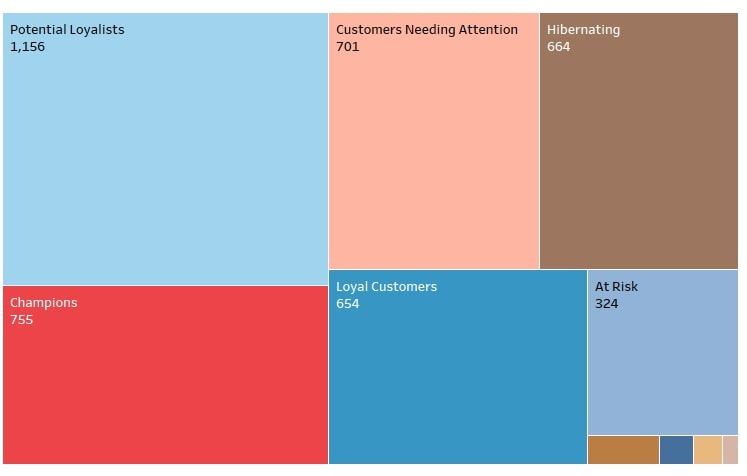

# Customer Segmentation for Cloud Kitchen using RFM Model

## Business Problem

A cloud kitchen aims to optimize its marketing efforts and improve customer retention. By segmenting its customers using the **Recency**, **Frequency**, **Monetary** (RFM) model, the kitchen can target marketing strategies more effectively and personalize customer engagement

Dataset
Size: 375,187 transactions
Unique Customers: 4,311
Unique Orders: 18,224
Countries: Most orders from the United Kingdom, followed by Germany and France

## Column Profiling
InvoiceNo: Unique identifier for each transaction.
StockCode: Product code.
Description: Product description.
Quantity: Number of products purchased.
InvoiceDate: Date of transaction.
UnitPrice: Price per product.
CustomerID: Unique identifier for each customer.
Country: Country of the customer

## Step 1 : Calculating Monetary Value
### Objective:
Understand the total monetary contribution of each customer

### Process:
> Multiply the UnitPrice by the Quantity to get the monetary value for each transaction.
> Group the data by CustomerID and sum the monetary values to get the total amount spent by each customer

## Step 2 : Calculating Frequency
### Objective: 
Determine how often each customer makes purchases

### Process:
> Group the data by CustomerID to get the first and last purchase dates for each customer.
> Count the number of unique orders (InvoiceNo) for each customer.
> Calculate the number of months each customer has been active by subtracting the first purchase date from the last purchase date and converting the result to months.
> Calculate the order frequency by dividing the number of unique orders by the number of active months

## Step 3 : Calculating Recency
###Objective: 
Measure the time since each customer's last purchase.
###Process:
>Set a reference date, typically the day after the last purchase date in the dataset.
>Subtract the date of each customer's last purchase from the reference date to calculate the number of days since their last purchase

## Step 4 : Merging RFM Metrics
### Objective: 
Combine monetary, frequency, and recency metrics into a single dataset for comprehensive analysis.
### Process:
>Merge the monetary data with the frequency and recency data based on CustomerID.
> Calculate RFM scores:
> Monetary Score: Categorize customers into quintiles (five groups) based on their total monetary value, assigning scores from 1 (lowest) to 5 (highest).
> Frequency Score: Categorize customers into quintiles based on their order frequency, assigning scores from 1 (lowest) to 5 (highest).
> Recency Score: Categorize customers into quintiles based on the number of days since their last purchase, assigning scores from 1 (longest time since last purchase) to 5 (shortest time since last purchase).

## Step 5 : Categorizing Customers
### Objective: 
Segment customers based on their RFM scores.
###Process:
> Define categories such as "Champions," "Loyal Customers," "Potential Loyalists," etc., based on combinations of recency, frequency, and monetary scores.
> Assign each customer to one of these categories

## Step 6 : Recommendations
### Objective: 
Provide specific marketing actions based on customer segments.
### Process:
For each customer category, outline targeted marketing actions. Examples include:
> Champions: Reward and engage them as brand promoters.
> Loyal Customers: Upsell higher value products and seek reviews.
> Potential Loyalists: Offer loyalty programs and recommendations.
> Recent Customers: Build early relationships.
> Promising: Increase brand awareness and offer trials.
> Customers Needing Attention: Provide limited-time offers and personalized recommendations.
> About To Sleep: Recommend best-seller products and offer discounts.
> At Risk: Reconnect with personalized emails and renewal offers.
> Cannot Lose Them: Win back with new products and engagement
> Hibernating: Offer relevant products and special discounts
> Lost: Revive interest with a reach-out campaign or decide to ignore

## Conclusion
This step-by-step data-driven analysis using the RFM model provides a structured approach to customer segmentation for the cloud kitchen. By categorizing customers based on their recency, frequency, and monetary value, targeted marketing strategies can be implemented to enhance customer engagement, retention, and overall revenue. The actionable recommendations aim to leverage the insights from this segmentation to optimize marketing efforts and drive business growth.

